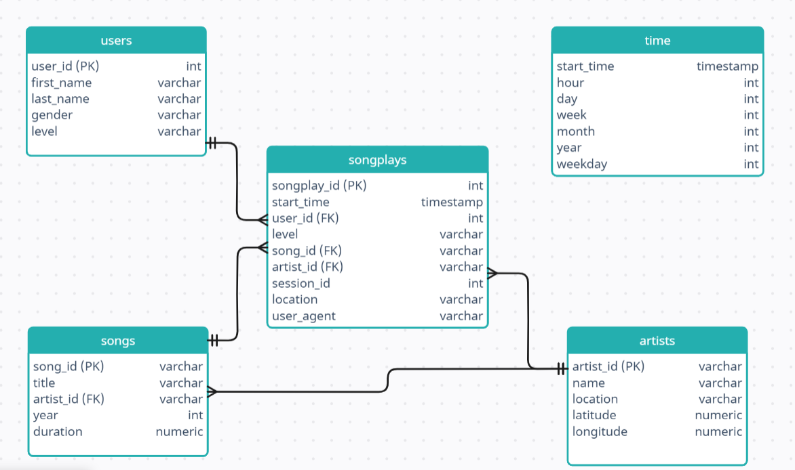

# JSON2Postgres - Efficient Data Modeling and ETL Pipeline for PostgreSQL Integration

## Introduction
The analytics team at TuneWave, a growing startup, seeks to delve into the data they've gathered regarding user activity and song information on their recently launched music streaming app. Specifically, they aim to comprehend users' listening preferences. However, accessing this data proves challenging as it's stored in a directory of JSON logs detailing user activity and another directory of JSON files containing metadata on the songs.

## Project Description
This project aims to make it easier for TuneWave's analytics team to access data by developing a Postgres database containing tables with efficient schema design and an ETL pipeline that extracts the relevant data from JSON files and loads it into the Fact and Dimension tables residing in the Postgres database using Python and SQL.

## Getting started

`python create_tables.py`</br>
`python etl.py`

## Python scripts

- create_tables.py: Clean previous schema and creates tables.
- sql_queries.py: All queries used in the ETL pipeline.
- etl.py: Read JSON logs and JSON metadata and load the data into generated tables.

## Database Schema


- songplays: Records in log data associated with song plays
- users: Users in the app
- songs: Songs in music database
- artists: Artists in music database
- time: Timestamps of records in songplays broken down into specific units

## ETL Pipeline Details


### song_data ETL

#### Source dataset
Each file is in JSON format and contains metadata about a song and the artist of that song. The files are partitioned by the first three letters of each song's track ID. For example, here are filepaths to two files in this dataset.

`song_data/A/B/C/TRABCEI128F424C983.json
song_data/A/A/B/TRAABJL12903CDCF1A.json
`

And below is an example of what a single song file, TRAABJL12903CDCF1A.json, looks like.
```json
{
  "num_songs": 1,
  "artist_id": "ARJIE2Y1187B994AB7",
  "artist_latitude": null,
  "artist_longitude": null,
  "artist_location": "",
  "artist_name": "Line Renaud",
  "song_id": "SOUPIRU12A6D4FA1E1",
  "title": "Der Kleine Dompfaff",
  "duration": 152.92036,
  "year": 0
}
```

#### Final tables
- songs table: Save song ID, title, artist ID, year, and duration from dataset

| song_id            | title                          | artist_id          | year | duration  |
|--------------------|--------------------------------|--------------------|------|-----------|
| SOFNOQK12AB01840FC | Kutt Free (DJ Volume Remix)    | ARNNKDK1187B98BBD5 | -    | 407.37914 |
| SOFFKZS12AB017F194 | A Higher Place (Album Version) | ARBEBBY1187B9B43DB | 1994 | 236.17261 |

- artist table: Save artist ID, name, location, latitude, and longitude from dataset

| artist_id          | name      | location        | lattitude | longitude |
|--------------------|-----------|-----------------|-----------|-----------|
| ARNNKDK1187B98BBD5 | Jinx      | Zagreb Croatia  | 45.80726  | 15.9676   |
| ARBEBBY1187B9B43DB | Tom Petty | Gainesville, FL | -         | -         |


### log_data ETL

#### Source dataset
The log files in the dataset you'll be working with are partitioned by year and month. For example, here are filepaths to two files in this dataset.

`log_data/2018/11/2018-11-12-events.json
log_data/2018/11/2018-11-13-events.json
`

And below is an example of what the data in a log file, 2018-11-12-events.json, looks like.
```json
{
  "artist": "Pavement",
  "auth": "Logged In",
  "firstName": "Sylvie",
  "gender": "F",
  "itemInSession": 0,
  "lastName": "Cruz",
  "length": 99.16036,
  "level": "free",
  "location": "Washington-Arlington-Alexandria, DC-VA-MD-WV",
  "method": "PUT",
  "page": "NextSong",
  "registration": 1540266185796.0,
  "sessionId": 345,
  "song": "Mercy:The Laundromat",
  "status": 200,
  "ts": 1541990258796,
  "userAgent": "\"Mozilla/5.0 (Macintosh; Intel Mac OS X 10_9_4) AppleWebKit/537.77.4 (KHTML, like Gecko) Version/7.0.5 Safari/537.77.4\"",
  "userId": "10"
}
```

#### Final tables

- time table: Select ts from dataset and save extracted the timestamp, hour, day, week of year, month, year, and weekday from the ts field.

| start_time                 | hour | day | week | month | year | weekday |
|----------------------------|------|-----|------|-------|------|---------|
| 2018-11-29 00:00:57.796000 | 0    | 29  | 48   | 11    | 2018 | 3       |
| 2018-11-29 00:01:30.796000 | 0    | 29  | 48   | 11    | 2018 | 3       |


- users table: Save user ID, first name, last name, gender and level. If duplicated user information is delivered, Update level field.

| user_id | first_name | last_name | gender | level |
|---------|------------|-----------|--------|-------|
| 79      | James      | Martin    | M      | free  |
| 52      | Theodore   | Smith     | M      | free  |


- songplays table: Save the timestamp, user ID, level, song ID, artist ID, session ID, location, and user agent from dataset. The song ID and artist ID will be retrieved by querying the songs and artists tables to find matches based on song title, artist name, and song duration time.

| songplay_id | start_time                 | user_id | level | song_id | artist_id | session_id | location                            | user_agent                                                                                                              |
|-------------|----------------------------|---------|-------|---------|-----------|------------|-------------------------------------|-------------------------------------------------------------------------------------------------------------------------|
| 1           | 2018-11-29 00:00:57.796000 | 73      | paid  | -       | -         | 954        | Tampa-St. Petersburg-Clearwater, FL | "Mozilla/5.0 (Macintosh; Intel Mac OS X 10_9_4) AppleWebKit/537.78.2 (KHTML, like Gecko) Version/7.0.6 Safari/537.78.2" |
| 2           | 2018-11-29 00:01:30.796000 | 24      | paid  | -       | -         | 984        | Lake Havasu City-Kingman, AZ        | "Mozilla/5.0 (Windows NT 6.1; WOW64) AppleWebKit/537.36 (KHTML, like Gecko) Chrome/36.0.1985.125 Safari/537.36"         |

